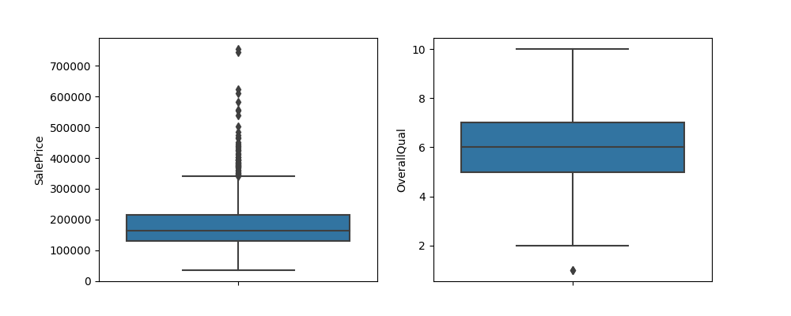

# Real Estate Feature Engineering Project

This is a project regarding Real Estate prices. The goal is to take a specific dataset, examine the features, and determine what prospective homebuyers care the most about.

Here is an example output image.
